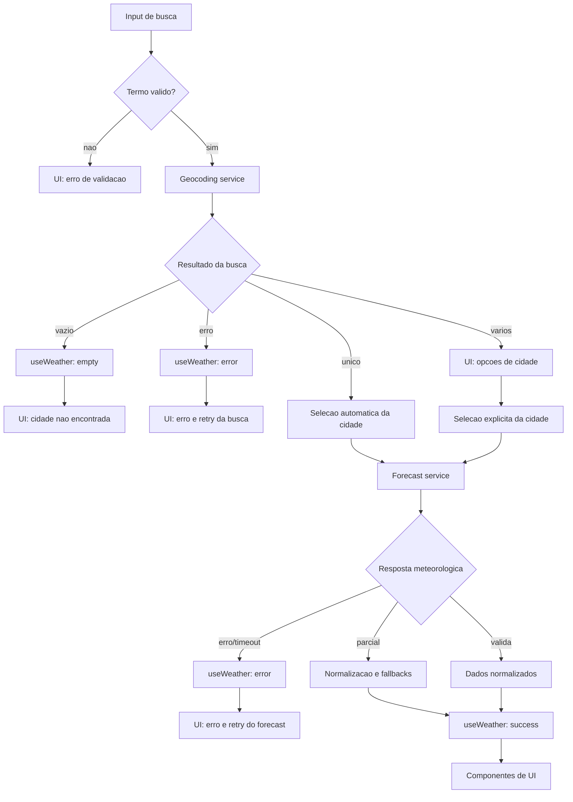

# Weather App Technical Plan

## Architecture

A aplicação será uma SPA React com cinco camadas simples:

1. **Presentation (`components/`)**: componentes React responsáveis por busca,
  resultados, estado vazio, loading, erros, clima atual, previsão e unidade.
  Eles recebem estado e callbacks, sem conhecer URLs ou regras de parsing.
2. **Application state (`hooks/`)**: hooks que coordenam cidade ativa,
  resultados, dados normalizados, unidade, loading, retry e erro. Esta camada
  chama os services e expõe um contrato orientado à tela.
3. **Data access (`services/`)**: clientes da geocodificação e previsão
  Open-Meteo, timeout, abort e normalização das respostas externas. Não renderiza
  UI nem decide como uma mensagem será apresentada.
4. **Pure domain functions (`lib/`)**: conversão de temperatura, mapeamento
  WMO, validação, formatação e seleção dos cinco dias. Não depende de React,
  rede, navegador ou estado mutável.
5. **Shared contracts (`types/`)**: interfaces e tipos compartilhados entre
  hooks, services e components, sem lógica de execução.

O fluxo permitido é `components -> hooks -> services/lib`, com `types` podendo
ser importado por todas as camadas. Components não acessam services diretamente
e services não importam components. Não haverá armazenamento local, cache ou
estado compartilhado entre sessões. Uma solicitação recebe um identificador
monotônico; respostas que não correspondem à solicitação ativa são descartadas.

Essa separação permite testar a maior parte das regras sem navegador ou rede:
`lib` usa testes unitários de entrada e saída; `services` usa mocks de `fetch`;
`hooks` usa respostas controladas para verificar estados e concorrência; e
`components` usa Testing Library para comportamento, acessibilidade e eventos.

## Tech Stack

- TypeScript strict, React e Vite.
- Tailwind CSS conforme o tema existente do projeto.
- Vitest e Testing Library para funções, serviços e componentes.
- Playwright para jornadas, responsividade e acessibilidade aplicável.
- Biome para lint e formatação.
- `fetch` nativo com `AbortController` para timeout de 10 segundos.

## Project Structure

```text
src/
  components/       # UI e apresentação
  hooks/             # Estado e orquestração
  services/         # Acesso aos dados Open-Meteo
  lib/              # Funções puras de domínio
  types/             # Contratos compartilhados
  App.tsx            # Composição da tela principal
tests/
  unit/             # Regras puras e serviços
  components/       # Comportamento dos componentes
  e2e/              # Jornadas com APIs interceptadas
```

## Data Model

Os tipos de domínio devem representar somente dados validados:

```ts
interface City {
  id: number // Identificador da localidade na geocodificação.
  name: string // Nome da cidade retornado pela Open-Meteo.
  latitude: number // Latitude usada na consulta meteorológica.
  longitude: number // Longitude usada na consulta meteorológica.
  country: string // Nome do país da localidade.
  admin1?: string // Região, estado ou província, quando disponível.
}

interface CurrentWeather {
  temperatureCelsius?: number // temperature_2m atual, normalizada para Celsius.
  weatherCode?: number // weather_code WMO da condição atual.
}

interface ForecastDay {
  date: string // daily.time no formato local YYYY-MM-DD.
  minimumCelsius?: number // daily.temperature_2m_min do dia.
  maximumCelsius?: number // daily.temperature_2m_max do dia.
  weatherCode?: number // daily.weather_code do dia.
}

interface WeatherData {
  city: City // Localidade usada como contexto da previsão.
  current: CurrentWeather // Condição meteorológica atual.
  forecast: ForecastDay[] // Cinco dias, de hoje até quatro dias adiante.
}

type Unit = 'celsius' | 'fahrenheit' // Unidade escolhida apenas para apresentação.
```

- `City`: `id`, `name`, `latitude`, `longitude`, `country` e `admin1`
  opcional.
- `CurrentWeather`: `temperatureCelsius` opcional e `weatherCode` opcional.
- `ForecastDay`: `date`, `minimumCelsius` opcional,
  `maximumCelsius` opcional e `weatherCode` opcional.
- `WeatherData`: cidade, clima atual e exatamente cinco itens de previsão quando
  houver datas suficientes.
- `Unit`: `celsius` ou `fahrenheit`.
- Estado público da aplicação: `idle`, `loading`, `success`, `error` ou
  `empty`, com erro tipado por operação.

Valores numéricos só são válidos quando são números finitos. Ausências são
representadas por `undefined`, nunca por zero. Arrays externos com tamanhos
desiguais são normalizados por índice, preservando a data e marcando o campo
ausente como indisponível. Menos de cinco datas gera erro de dados inválidos,
pois não atende ao contrato mínimo da previsão.

## Data Flow



1. O usuário envia o formulário por botão ou Enter.
2. O termo é aparado; vazio produz erro de validação sem chamada de rede.
3. O serviço de geocodificação cria uma URL com `URLSearchParams` e inicia o
   timeout.
4. Zero resultados produz `no-results`; um resultado é selecionado; vários
   ficam disponíveis para seleção explícita.
5. A seleção invalida o resultado anterior, limpa os dados meteorológicos e
   inicia a previsão pelas coordenadas selecionadas.
6. A resposta é validada e normalizada antes de chegar aos componentes.
7. A unidade (`Unit`) altera somente a apresentação dos valores já normalizados.
8. Retry meteorológico reutiliza a cidade ativa e não repete geocodificação.

## External APIs

### Geocoding

URL: `https://geocoding-api.open-meteo.com/v1/search?name={cidade}&count=5&language=pt&format=json`

Parâmetros relevantes: `name` recebe o termo aparado e codificado,
`count=5` limita as opções exibidas e `language=pt` solicita nomes em
português. `format=json` explicita o formato da resposta. O cliente deve
construir a URL com `URLSearchParams`, sem interpolar texto diretamente.

Resposta resumida:

```json
{
  "results": [
    {
      "id": 2267057,
      "name": "Lisbon",
      "latitude": 38.7167,
      "longitude": -9.1333,
      "country": "Portugal",
      "admin1": "Lisboa"
    }
  ]
}
```

Mapeamento: cada `results[]` válido gera um `City` com `id`, `name`,
`latitude`, `longitude`, `country` e `admin1` opcional. `results` ausente ou
vazio vira uma busca sem resultados; um item gera seleção automática e vários
itens permanecem para escolha explícita.

Respostas HTTP não OK, JSON inválido ou itens sem coordenadas são falhas de
geocodificação. O termo original deve ser preservado no estado da aplicação.

### Forecast

URL: `https://api.open-meteo.com/v1/forecast?latitude={lat}&longitude={lon}&current=temperature_2m,weather_code&daily=weather_code,temperature_2m_max,temperature_2m_min&temperature_unit=celsius&timezone=auto&forecast_days=5`

Parâmetros relevantes: `latitude` e `longitude` vêm do `City`; `current`
solicita `temperature_2m,weather_code`; `daily` solicita
`weather_code,temperature_2m_max,temperature_2m_min`;
`temperature_unit=celsius` fixa a unidade interna; `timezone=auto` usa o fuso
da coordenada; e `forecast_days=5` limita a previsão a cinco datas.

Resposta resumida:

O exemplo mostra dois itens diários apenas para brevidade; a resposta válida
para a aplicação deve conter cinco datas e valores alinhados.

```json
{
  "timezone": "Europe/Lisbon",
  "current": {
    "temperature_2m": 20.4,
    "weather_code": 0
  },
  "daily": {
    "time": ["2026-09-30", "2026-10-01"],
    "temperature_2m_min": [15.2, 14.8],
    "temperature_2m_max": [24.1, 22.7],
    "weather_code": [0, 2]
  }
}
```

Mapeamento: `current.temperature_2m` vira `CurrentWeather.temperatureCelsius`
e `current.weather_code` vira `CurrentWeather.weatherCode`. Cada índice dos
arrays `daily` gera um `ForecastDay`: `time` vira `date`, os valores mínimo e
máximo viram `minimumCelsius` e `maximumCelsius`, e `weather_code` vira
`weatherCode`. A unidade Celsius é mantida internamente porque nenhum
parâmetro Fahrenheit é enviado.

As datas `daily.time` são strings locais `YYYY-MM-DD` e não devem ser
convertidas para o fuso do dispositivo. Respostas HTTP não OK, JSON inválido,
timezone ausente ou menos de cinco datas são falhas meteorológicas; campos
numéricos ausentes permanecem indisponíveis conforme o modelo de dados.

## State Management

O estado vive no hook `useWeather`, montado no topo em `App.tsx`. `App` passa
estado e callbacks por props para os componentes; components não mantêm uma
segunda cópia da cidade, dos dados meteorológicos ou da unidade.

O contrato público do hook usa somente estes estados explícitos:

- `idle`: sessão iniciada, sem cidade selecionada e sem solicitação ativa.
- `loading`: geocodificação ou forecast em andamento.
- `success`: cidade ativa e `WeatherData` validado disponível.
- `empty`: geocodificação concluída sem resultados.
- `error`: falha de validação, rede, API, timeout ou resposta inválida.

O hook mantém o termo de busca, resultados de cidade, cidade ativa, dados
brutos normalizados, unidade, erro e `requestId`. A unidade começa em Celsius
a cada montagem e não é persistida. A cidade ativa só muda após seleção
válida; ao selecionar outra, os dados anteriores são removidos antes de
entrar em `loading`.

A apresentação deriva os valores sem novo request. `CurrentWeather` e
`ForecastDay` armazenam apenas Celsius; uma função pura de `lib` recebe um
valor Celsius e `Unit`, retornando o valor arredondado para exibição:

- Celsius: arredondar o valor original ao inteiro mais próximo.
- Fahrenheit: arredondar `celsius * 9 / 5 + 32` ao inteiro mais próximo.
- Ausência ou valor inválido: retornar o fallback de indisponibilidade.

Essa derivação ocorre durante a renderização ou em uma função de apresentação;
alterar `Unit` atualiza as props exibidas, mas não altera `WeatherData`, não
refaz normalização e não chama nenhum service.

Cada busca e previsão terá um `requestId`. O callback só atualiza o estado se o
identificador ainda for o ativo; além disso, o controlador anterior será
abortado quando uma nova solicitação do mesmo tipo começar.

## Error Handling

O erro será classificado por `kind`, sem expor detalhes técnicos à interface:

```ts
type WeatherErrorKind =
  | 'validation'
  | 'network'
  | 'api'
  | 'timeout'
  | 'invalid-response'

interface WeatherError {
  kind: WeatherErrorKind
  message: string
  retryable: boolean
}
```

- **Validação:** campo vazio; permanece disponível para nova busca e não faz
  request.
- **Rede:** falha de conexão ou `fetch`; preserva o termo ou cidade e oferece
  nova tentativa quando aplicável.
- **API:** resposta HTTP não OK; geocodificação e forecast recebem mensagens
  distintas e a ação de retry adequada.
- **Timeout:** `AbortController` encerra a solicitação após 10 segundos;
  remove loading e permite tentar novamente.
- **Resposta parcial:** campos ausentes não viram zero; temperatura atual usa
  `Temperatura indisponível`, mínimas/máximas usam `Indisponível` e códigos
  desconhecidos usam `Condição não disponível`. Se as cinco datas existirem,
  os demais campos válidos continuam visíveis. Menos de cinco datas ou
  estrutura inválida produz `invalid-response`.

Loading será exposto por `role="status"`; erros por `role="alert"`. Respostas
antigas são ignoradas pelo `requestId`, mesmo que o abort não impeça a entrega.

Mensagens de interface e descrições WMO ficam em pt-BR. O mapeamento deve
cobrir os códigos WMO 0, 1, 2, 3, 45, 48, 51, 53, 55, 56, 57, 61, 63, 65,
66, 67, 71, 73, 75, 77, 80, 81, 82, 85, 86, 95, 96 e 99. Qualquer outro
código exibe `Condição não disponível`.

## Testing Strategy

### Vitest

Vitest será usado para testes rápidos e determinísticos, sem depender de
servidor ou disponibilidade da Open-Meteo:

- **Funções puras em `lib/`:** conversão Celsius/Fahrenheit e arredondamento,
  mapeamento de todos os códigos WMO, formatação de datas, validação e
  normalização de campos ausentes.
- **Services:** mock de `fetch` para verificar URL, parâmetros, codificação de
  termos, parsing, respostas HTTP não OK, JSON inválido, timeout e abort.
- **Hook `useWeather`:** transições entre `idle`, `loading`, `success`,
  `error` e `empty`, retry, limpeza ao trocar cidade e descarte de respostas
  fora de ordem.
- **Componentes:** Testing Library para os estados `loading`, `error`,
  `empty` e `success`, incluindo mensagens acessíveis, seleção de resultados,
  retry, teclado e troca de unidade sem novo request.
- **Requisitos transversais:** verificar o início do loading em até 100 ms, a
  apresentação em até 500 ms após uma resposta controlada, ausência de
  armazenamento/cache, codificação segura da busca e renderização como texto.

Os testes de services não chamam a rede real. Os testes de componentes recebem
estado controlado ou mockam o hook, mantendo a lógica de rede coberta na camada
de services e a composição completa reservada ao Playwright.

### Playwright

Playwright será usado para fluxos E2E com a aplicação montada e APIs
interceptadas por rota, mantendo respostas determinísticas sem depender da
Open-Meteo real. As jornadas cobrirão:

- busca explícita por botão e Enter, campo vazio e caracteres especiais;
- seleção automática de um resultado e seleção explícita entre vários;
- carregamento, clima atual, previsão de cinco dias e troca C/F sem nova
  chamada;
- estados sem resultados, erro de API, falha de rede, timeout e retry;
- troca de cidade, limpeza de dados anteriores e respostas fora de ordem;
- navegação por teclado, anúncios de status/alerta e ausência de rolagem
  horizontal.

As jornadas responsivas serão executadas nos viewports de 320, 768 e 1280 px.
Para atender ao RNF-08, o Playwright deve configurar projetos para Chromium,
Firefox e WebKit, além de Safari iOS e Chrome Android quando esses dispositivos
estiverem disponíveis no CI. A interceptação das APIs mantém a mesma massa de
dados em todos os projetos.

## Risks & Trade-offs

- `timezone=auto` simplifica a data local sem depender do relógio do usuário,
  mas exige validar o timezone na resposta.
- Abort e `requestId` são usados juntos: abort reduz trabalho de rede e o
  identificador protege contra respostas que já tenham sido entregues.
- A ausência de cache reduz complexidade e respeita o escopo, mas pode gerar
  chamadas repetidas para a mesma cidade.
- O contrato exige cinco dias; uma resposta menor falha de forma explícita em
  vez de apresentar uma previsão enganosa.
- Vitest oferece feedback rápido e isola regras, mas não prova a integração
  completa entre navegador, componentes e serviços.
- Playwright cobre a jornada real e responsividade, mas é mais lento e pode
  ser mais sensível a timing; interceptar APIs reduz flakiness, porém não
  valida a disponibilidade real da Open-Meteo.
- Mockar `fetch` diretamente mantém as dependências pequenas e explícitas;
  MSW seria uma alternativa mais próxima de respostas HTTP reais, mas adiciona
  configuração sem benefício necessário para este escopo.
- Testar componentes isoladamente com estado controlado é mais rápido que
  repetir toda a jornada E2E, mas exige complementaridade com os fluxos do
  Playwright para detectar problemas de composição.
- A matriz completa de navegadores do RNF-08 oferece maior cobertura, ao custo
  de execução e manutenção adicionais; ainda assim, ela é o critério de
  compatibilidade da entrega, não uma melhoria opcional.

## Traceability

- RF-01/RF-02: geocoding service, busca e seleção.
- RF-03/RF-04: forecast service, normalização, WMO e componentes meteorológicos.
- RF-05: `Unit` e utilitários de conversão.
- RF-06/RF-07/RF-09: hook de estado, timeout, abort e `requestId`.
- RF-08: estado inicial da apresentação.
- RNF-01 a RNF-10: contratos de serviço, acessibilidade, responsividade e
  suíte unitária/E2E.